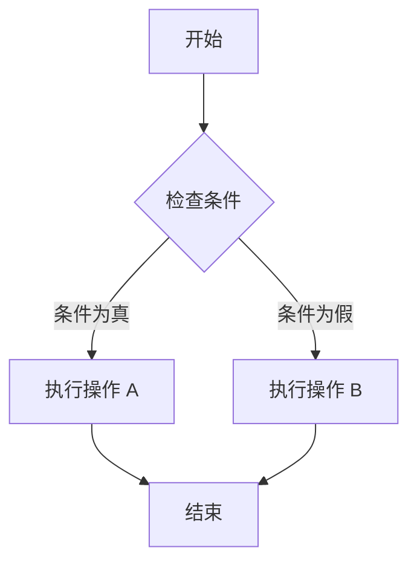

# Markdown 示例

这是一份综合性的 Markdown 文档，用于展示各种元素的用法。

## 图片

下面是一个示例图片：


## 表格

这是一个简单的表格：

| 姓名   | 年龄 | 职业       |
|--------|------|------------|
| 张三   | 30   | 工程师     |
| 李四   | 25   | 设计师     |
| 王五   | 35   | 产品经理   |

## 代码块

这是一个 JavaScript 代码块的例子，带有语法高亮：

```javascript
function bubbleSort(arr) {
  let len = arr.length;
  for (let i = 0; i < len; i++) {
    for (let j = 0; j < len - 1 - i; j++) {
      if (arr[j] > arr[j + 1]) {
        // 交换元素
        let temp = arr[j];
        arr[j] = arr[j + 1];
        arr[j + 1] = temp;
      }
    }
  }
  return arr;
}

const numbers = [5, 3, 8, 4, 2];
console.log('排序后的数组:', bubbleSort(numbers));
```
## 公式
$E=mc^2$

## UML
$$uml
partition Conductor {
  (*) --> "Climbs on Platform"
  --> === S1 ===
  --> Bows
}

partition Audience #LightSkyBlue {
  === S1 === --> Applauds
}

partition Conductor {
  Bows --> === S2 ===
  --> WavesArmes
  Applauds --> === S2 ===
}

partition Orchestra #CCCCEE {
  WavesArmes --> Introduction
  --> "Play music"
}
$$

## 流程图 (Mermaid 语法)

许多现代 Markdown 编辑器支持 Mermaid.js 来渲染图表。



## 数学公式 (KaTeX)

这是一个使用 KaTeX 渲染的公式：

$
\frac{\partial u}{\partial t} = \alpha \nabla^2 u
$

---

**注意**: 流程图的显示效果取决于您使用的 Markdown 查看器或编辑器是否支持 Mermaid.js 语法。在像 Typora、Obsidian 或启用了相应插件的 VS Code 中，它会被渲染成一个图形。
